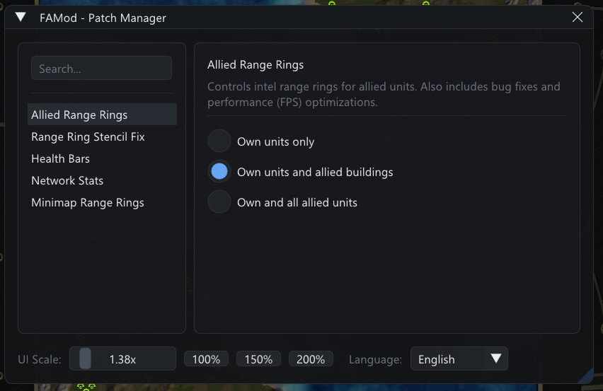
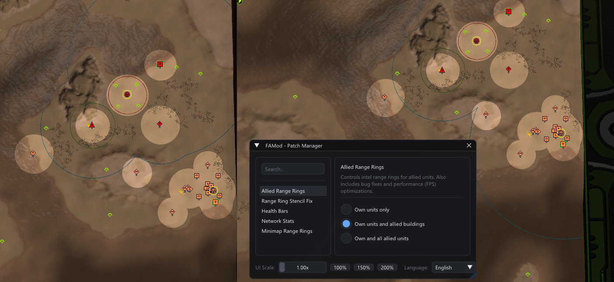
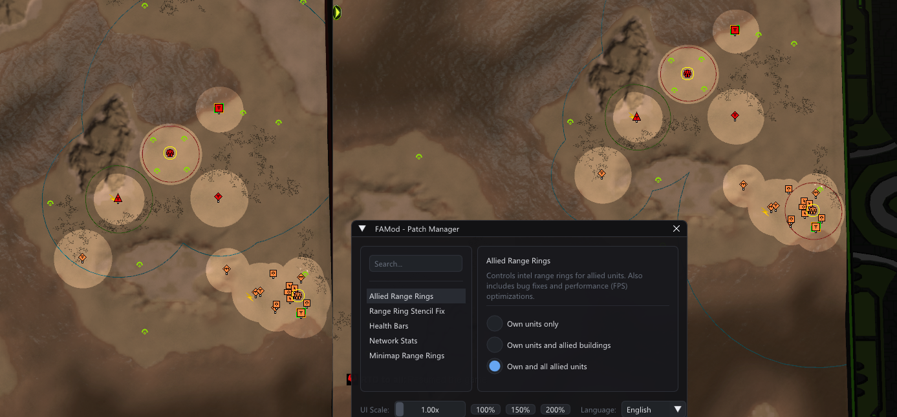
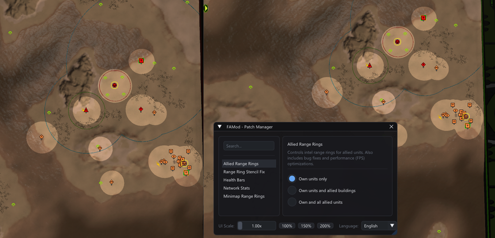
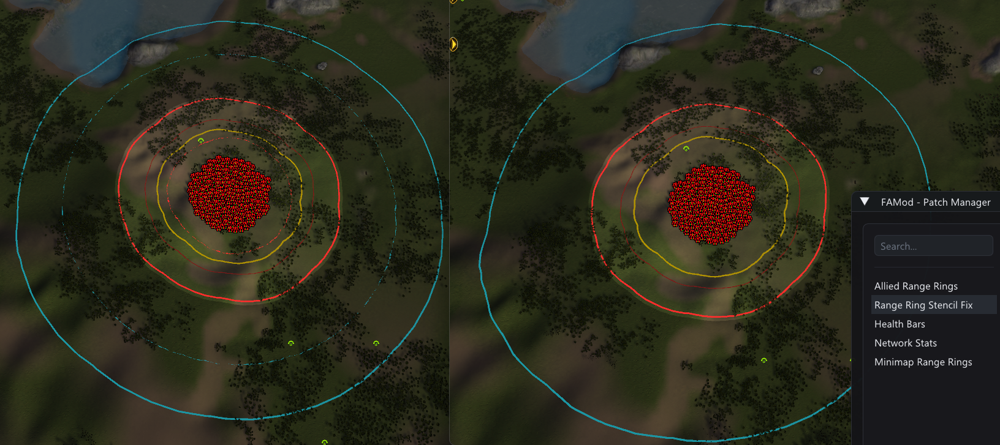
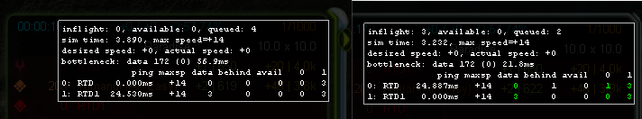
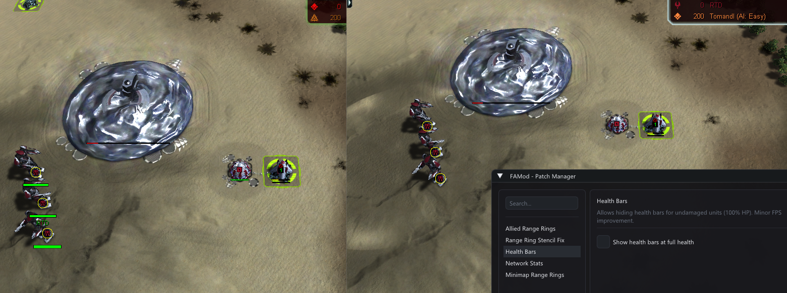
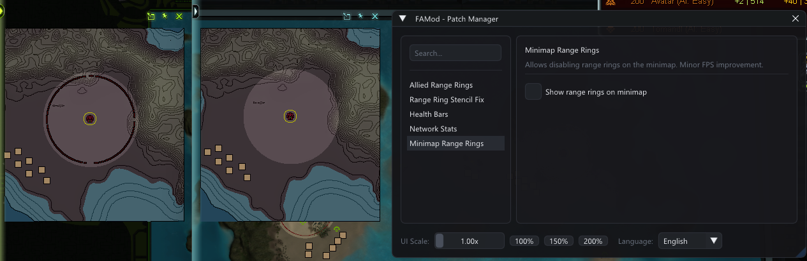

# FAMod — Forged Alliance Binary Enhancement Suite

[](https://en.cppreference.com/w/cpp/23)
[](https://xmake.io)
[]()
[](LICENSE)

**FAMod** is a lightweight in-game enhancement mod and binary patch suite for **[FAForever (Forged Alliance Forever)](https://faforever.com/)**.

> [!IMPORTANT]
> **Compatibility Notice**: FAMod is currently compatible **only with FAForever (FAF)**. It targets the engine modifications and structures present in FAForever's patched binary and will **not** work on vanilla Steam, GOG, or retail CD versions (non-FAF executables are automatically detected and rejected to prevent crashes).

**In-Game GUI**: Press **`~` (Tilde)** at any time to configure patches



---

## 🚀 Player Quick Start Guide

### Installation

1. Download the latest **`dsound.dll`** from the [Releases](https://github.com/RutreD/FAmod/releases) page.
2. Place `dsound.dll` directly into your FAForever binary directory alongside `ForgedAlliance.exe`.
   > **Default FAF Path**: `C:\ProgramData\FAForever\bin`
   * **Replays**: To make FAMod work when watching replays, also copy `dsound.dll` into the replay binary directory:
     > **Default Replay Path**: `C:\ProgramData\FAForever\replaydata\bin`
3. Launch the game via the **FAForever Client** and play as usual!

### Using the In-Game Menu

* Press **`~` (Tilde / Backquote)** on your keyboard at any time in-game to toggle the configuration menu.
* **UI Scaling**: If you play on a high-DPI (2K / 4K) monitor, use the UI scale slider in the top bar to resize the menu comfortably.
* **Languages**: Full built-in localization in **English**, **Русский (Russian)**, and **简体中文 (Simplified Chinese)**.
* **Auto-Save**: All changes are automatically persisted to `famod_settings.json` in your game folder.

### Uninstallation

To remove FAMod, simply delete `dsound.dll` and `famod_settings.json` from your `FAForever\bin` folder (and from `FAForever\replaydata\bin` if installed for replays).

---

## ✨ Features & Patches


### 1. 📡 Allied Range Rings
* **What it does**: Adds the ability to view allied intel range rings (Radar, Sonar, Omni) with three selectable modes:
  - **Own units only**: Standard vanilla behavior.
  - **Own units and allied static structures**: Shows allied radar towers, sonars, and bases without cluttering the screen with mobile units.
  - **Own and all allied units**: Full vision coverage for all allied units and structures.
* **Preview** *(Vanilla vs. FAMod Enabled)*:

  **Allied Buildings**
  

  **All Allied Units**
  

  **Own Units Only**
  

---

### 2. 🛡️ Range Ring Stencil Fix
* **What it does**: Fixes the game engine's internal stencil buffer overflow when rendering numerous overlapping range rings on screen. Eliminates visual artifacts and delivers a FPS boost.
* **Preview**:
  

---

### 3. 📶 Network Stats Colorizer
* **What it does**: Color-codes player latency and ping in the in-game connectivity screen (green $\to$ yellow $\to$ red), allowing you to immediately spot lagging players or connectivity spikes.
* **Preview**:
  

---

### 4. ❤️ Health Bars Visibility
* **What it does**: Allows hiding health bars for full-health units (100% HP), keeping the battlefield visually clean and reducing draw overhead.
* **Preview**:
  

---

### 5. 🗺️ Minimap Range Rings
* **What it does**: Allows toggling range rings on the minimap, keeping tactical radar views clean and uncluttered.
* **Preview**:
  

---

## ❓ Frequently Asked Questions (FAQ)

<details>
<summary><b>Why should I trust FAMod? / Is this safe? / My antivirus flagged dsound.dll</b></summary>
FAMod is completely open-source (MIT licensed) and fully transparent. All binary builds are built publicly through <b>GitHub Actions</b> directly from the codebase. You don't have to trust opaque prebuilt binaries: you can inspect every line of code, verify GitHub Actions build logs, or build the DLL yourself locally or in your own GitHub fork.
Because FAMod uses a standard DirectX proxy DLL technique (named <code>dsound.dll</code>) to load alongside <code>ForgedAlliance.exe</code>, some overly aggressive heuristics may flag it as unknown. The entire project is open source, safe, and can be built from source yourself.
</details>

<details>
<summary><b>Can I use FAMod with the Steam or GOG version of Supreme Commander: Forged Alliance?</b></summary>
No. FAMod is designed specifically for <b>FAForever (FAF)</b> and relies on the patched engine binaries generated by the FAF ecosystem. Running FAMod with unpatched Steam, GOG, or retail versions is not supported — FAMod will automatically detect the executable format and gracefully abort initialization to prevent game crashes.
</details>

<details>
<summary><b>Where is my FAForever folder located?</b></summary>
The default path is <code>C:\ProgramData\FAForever\bin</code> (and <code>C:\ProgramData\FAForever\replaydata\bin</code> for replays). Note that <code>ProgramData</code> is a hidden folder by default in Windows Explorer (press <code>Win + R</code>, type <code>C:\ProgramData\FAForever\bin</code>, and press Enter).
</details>

---
---

# 🧑‍💻 Developer & AI Sloper Guide

This section is for developers and AI coding agents working on the codebase, adding binary patches, or building custom configurations.

## ☁️ Building with GitHub Actions (Zero Local Setup)

You can build your own `dsound.dll` in the cloud without installing compilers or build tools locally:

1. **Fork** this repository to your GitHub account.
2. Navigate to the **Actions** tab in your fork.
3. In the left sidebar, select the **Release** workflow.
4. Click **Run workflow** on the right:
   - **Build mode**: `release` (or `debug`)
   - **C/C++ Runtime**: `MT` (static runtime)
5. When the run finishes, download `dsound.dll` in either of two ways:
   - **From your Fork's Releases**: The workflow automatically publishes a Nightly Release under the **Releases** tab of your fork.
   - **From Workflow Artifacts**: Download the zip from the **Artifacts** section at the bottom of the Action run summary page.

---

## 🛠️ Local Building & Toolchain Setup

### Tested Compilers & Versions

The project requires a C++23 compiler with C++20 standard library module support (`import std;`):

| Compiler / Toolchain | Tested Version | Target | Configuration Command |
| :--- | :--- | :--- | :--- |
| **MSVC** | Visual Studio 2022 (MSVC v19.40+, Toolset 14.40+) | x86 (32-bit) | `xmake f -p windows -a x86 --toolchain=msvc -m release` |
| **LLVM Clang** | Clang 22.1.0+ (`x86_64-pc-windows-msvc` target) | x86 (32-bit) | `xmake f -p windows -a x86 --toolchain=clang -m release` |
| **MinGW-w64 (GCC)** | GCC 16.2.0 (`i686-win32-dwarf-rev1`) | x86 (32-bit) | `xmake f -p windows -a x86 --toolchain=mingw -m release` |

### Local Build Commands

```powershell
# 1. Standard Release Build
xmake f --toolchain=msvc -m release
xmake

# 2. Debug Build with Debug Console Output
xmake f --toolchain=msvc -m debug
xmake

# 3. Build + Automatically Deploy to Game Directory and Launch
xmake f --toolchain=msvc -m release --launch_game=true --game_path="C:/ProgramData/FAForever/bin"
xmake

# 4. Clean Rebuild
xmake clean
xmake -r
```

The compiled proxy DLL will be output to:
`build/windows/x86/release/dsound.dll`

---

## 🧩 How to Create and Add a New Patch

Patches are modular C++23 modules located under `src/patches/<patch_name>/`. You can write a patch as a **single file** or split it into **multiple module files** (e.g. separating engine hooks in `patch.cppm` and ImGui UI in `ui.cppm`).

### Single File Patch (`patch.cppm`) for smaller patches (e.g., `src/patches/range_ring_stencil/patch.cppm`).

`src/patches/my_feature/patch.cppm`:
```cpp
module;
#include <imgui.h>
#include <xbyak/xbyak.h>

export module patch.my_feature;
import fa;
import core;

using namespace fa;

export class MyFeaturePatch : public IPatch {
public:
  inline static bool enabled_{true};

  [[nodiscard]] std::string_view Name() const noexcept override {
    return tr("My Feature", {
      {Language::Russian, "Моя фича"},
      {Language::Chinese, "我的功能"}
    });
  }

  [[nodiscard]] std::string_view Description() const noexcept override {
    return tr("Description of what this patch does.", {
      {Language::Russian, "Описание работы патча."},
      {Language::Chinese, "补丁功能说明。"}
    });
  }

  void Apply() override;

  void RenderUi() override {
    ImGui::Checkbox("Enable feature", &enabled_);
  }

  void SaveSettings(SettingsStore &s) const override {
    s.Set("MyFeature.enabled", enabled_);
  }

  void LoadSettings(const SettingsStore &s) override {
    enabled_ = s.Get<bool>("MyFeature.enabled", true);
  }
};

void MyFeaturePatch::Apply() {
  // Apply hooks / memory patches here
}
```

### Step 2: Register the Patch in `core::app`
In `src/core/app.cppm`:
1. Import your patch module:
   ```cpp
   import patch.my_feature;
   ```
2. Register the patch class inside `Initialize()`:
   ```cpp
   registry.RegisterPatch<MyFeaturePatch>();
   ```

### Step 3: Build and Test
Run `xmake`. All `src/**.cppm` files are compiled automatically by xmake! The patch will now appear in the in-game GUI with persistent settings and localization.

---

## 📄 License

This project is licensed under the [MIT License](LICENSE).
